# 📊 Retail Intelligence Platform

### Demand Forecasting, Inventory Optimization & Time Series Analysis using Machine Learning, Streamlit and Power BI

---

# 📖 Overview

Retail businesses often struggle with balancing inventory levels due to uncertain customer demand. Overstocking increases storage costs and capital investment, while understocking leads to missed sales opportunities and dissatisfied customers.

This project presents an end-to-end Retail Intelligence Platform that combines Machine Learning, Time Series Forecasting, Business Intelligence, and Interactive Visualization to predict future product demand and generate inventory optimization insights.

The system analyzes historical sales data, learns demand patterns using multiple forecasting models, compares their performance, predicts future demand, identifies products requiring replenishment, and visualizes business insights through an interactive Streamlit application and Power BI dashboard.

The project follows the complete Data Science lifecycle:

- Data Collection
- Data Cleaning
- Exploratory Data Analysis
- Feature Engineering
- Machine Learning Model Development
- Time Series Forecasting
- Model Evaluation
- Inventory Optimization
- Dashboard Development
- Streamlit Deployment

---

# 🚀 Project Workflow

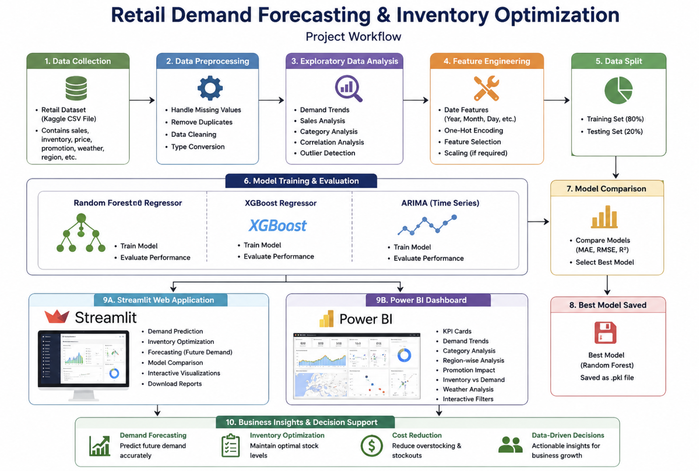

---

# 🎯 Business Problem

Retail stores frequently experience:

- Overstocking of low-demand products
- Stock-outs of high-demand products
- Inefficient inventory allocation
- Poor forecasting accuracy
- Difficulty identifying products requiring replenishment

This project addresses these challenges using predictive analytics and machine learning.

---

# 💡 Solution

The platform predicts future product demand using historical sales data and recommends inventory actions through:

- Machine Learning Demand Prediction
- Time Series Forecasting
- Inventory Optimization
- Product Reorder Identification
- Business Intelligence Dashboard
- Interactive Streamlit Application

---

# 🛠️ Technologies Used

| Category | Technologies |
|-----------|-------------|
| Programming | Python, SQL |
| Data Processing | Pandas, NumPy |
| Database Querying | SQL |
| Machine Learning | Scikit-learn, XGBoost |
| Time Series Forecasting | ARIMA (Statsmodels) |
| Data Visualization | Matplotlib, Seaborn |
| Business Intelligence | Power BI |
| Web Application | Streamlit |
| Model Serialization | Joblib |
| Version Control | Git, GitHub |

---

# 📈 What This Project Demonstrates

- End-to-end Data Science workflow
- SQL-based data extraction and analysis
- Machine Learning model development and comparison
- Time Series Forecasting using ARIMA
- Retail demand prediction
- Inventory optimization strategies
- Interactive Business Intelligence dashboards using Power BI
- Deployment of ML models using Streamlit
- Model evaluation using R², MAE, and RMSE
- Business-focused analytical decision making

---

# 📊 Exploratory Data Analysis

During EDA, several business insights were extracted including:

- Product demand distribution
- Sales trends over time
- Feature correlation analysis
- Customer purchasing behavior
- Inventory distribution
- Product category analysis
- Seasonal demand variations

---

# ⚙️ Feature Engineering

The following preprocessing steps were performed:

- Missing value treatment
- Duplicate removal
- Data type conversion
- Feature encoding
- Feature scaling
- Date feature extraction
- Inventory feature generation

---

# 🤖 Machine Learning Models

Instead of relying on a single algorithm, three different forecasting techniques were implemented and compared.

| Model | Purpose | Advantages | Limitations |
|-------|----------|------------|------------|
| Random Forest | Primary Demand Prediction | High accuracy, captures non-linear relationships, robust to outliers | Large model size, slower training |
| XGBoost | Performance Benchmark | Excellent predictive power, handles complex relationships, regularization | Requires hyperparameter tuning, computationally intensive |
| ARIMA | Time Series Forecasting | Captures temporal trends and seasonality | Assumes stationary data, limited for complex nonlinear patterns |

---

# 📈 Model Evaluation

The models were evaluated using standard regression metrics.

| Metric | Purpose |
|---------|----------|
| R² Score | Measures goodness of fit |
| MAE | Average prediction error |
| RMSE | Penalizes larger prediction errors |

After evaluation, the **Random Forest Regressor** achieved the best balance of accuracy and generalization performance and was selected as the final prediction model.

ARIMA was used for future trend forecasting and XGBoost served as a benchmark model for comparison.

---

# 📦 Inventory Optimization

Beyond demand prediction, the project provides inventory intelligence by:

- Identifying products requiring reorder
- Estimating inventory shortages
- Supporting replenishment planning
- Improving stock availability
- Reducing excess inventory costs

---

# 🌐 Streamlit Application

The interactive web application enables users to:

- Predict Product Demand
- Estimate Future Sales
- Optimize Inventory
- View Product Status
- Compare Model Performance
- Analyze Forecast Results

---

# 📊 Power BI Dashboard

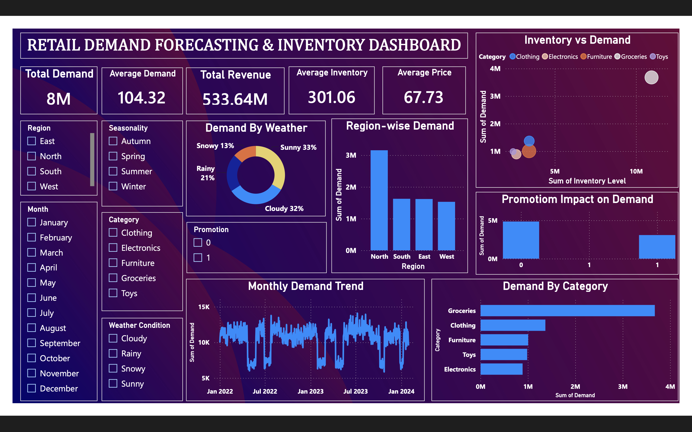

The Power BI dashboard provides business users with interactive insights including:

- Sales Overview
- Inventory KPIs
- Demand Forecasting
- Product Performance
- Inventory Optimization
- Reorder Analysis
- Forecast Trends

---

# 📸 Dashboard Screenshots

## Workflow

---

## Home Dashboard

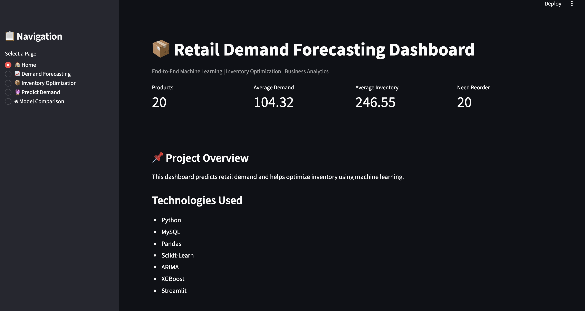

---

## Predict Demand

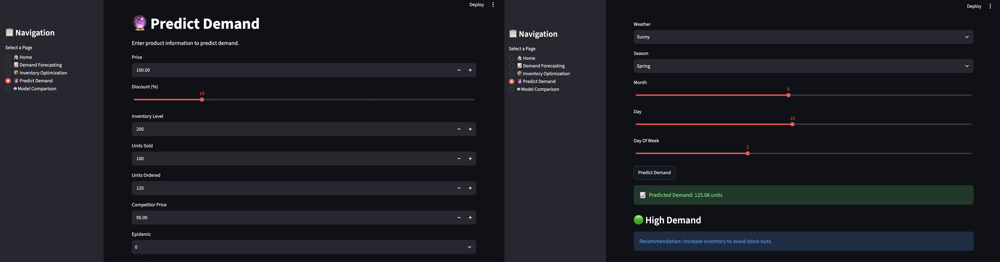

---

## Inventory Optimization

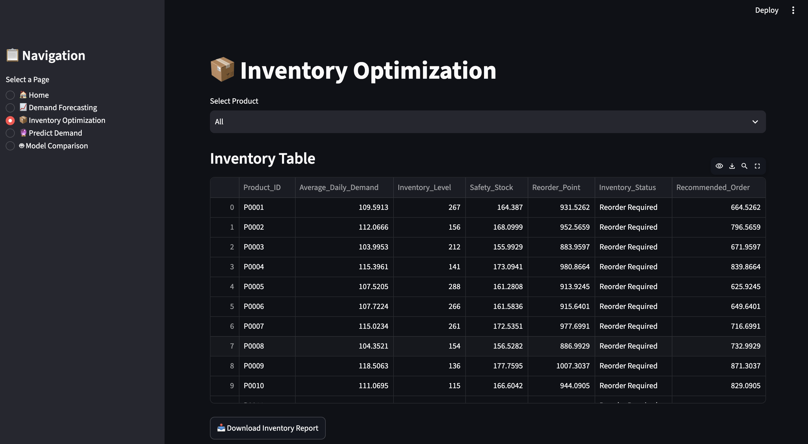

---

## Products Requiring Reorder

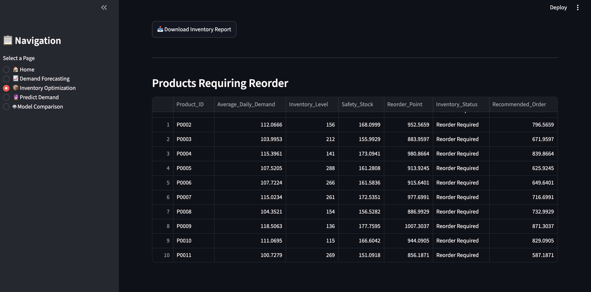

---

## Model Comparison

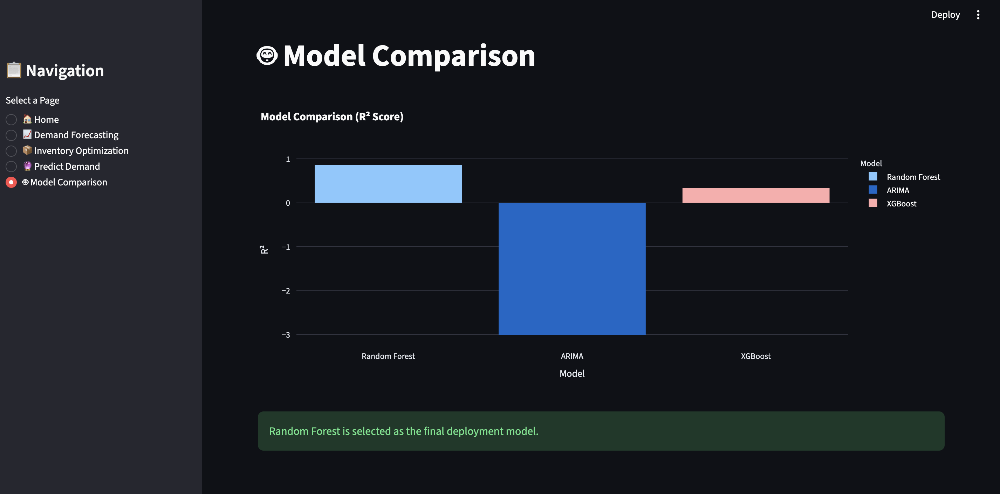

---

## Correlation Heatmap

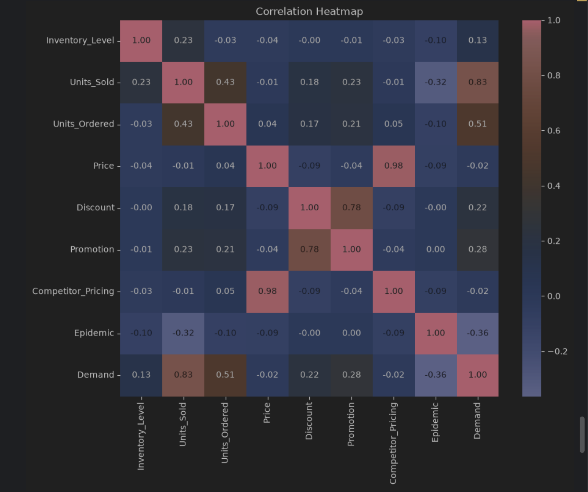

---

## Actual vs Predicted

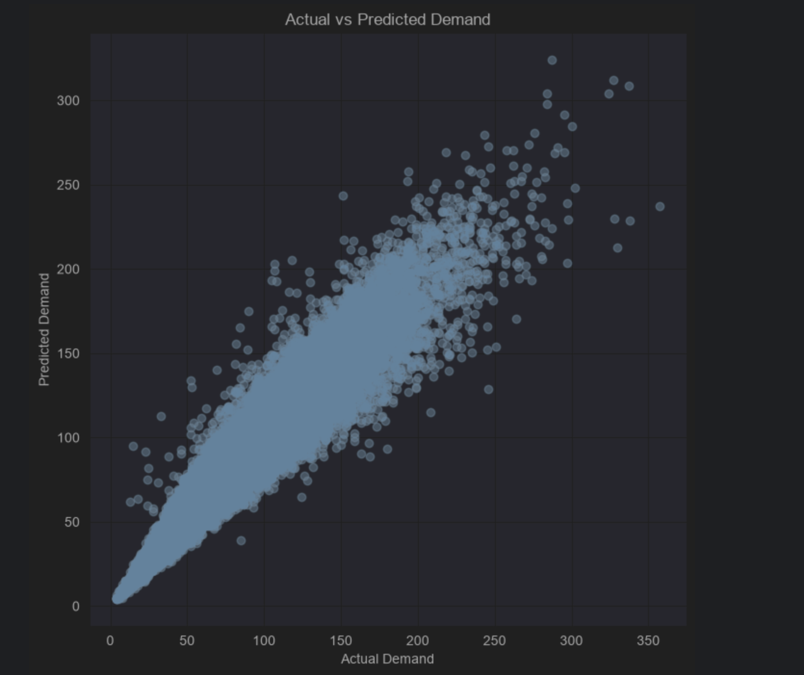

---

## Performance Metrics

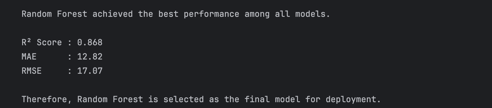

---

## ARIMA Forecast

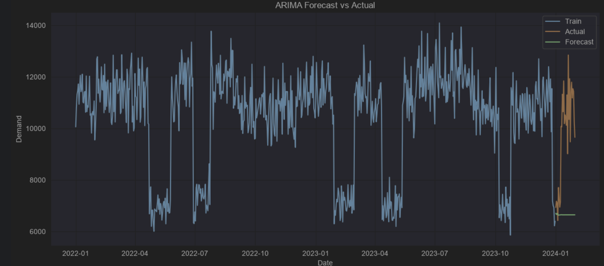

---

# 📈 Key Features

Retail Demand Forecasting

Inventory Optimization

Time Series Forecasting

Machine Learning Model Comparison

Power BI Dashboard

Interactive Streamlit Application

Product Reorder Recommendation

Business KPI Visualization

---

# 🔮 Future Improvements

- Deep Learning Forecasting (LSTM)
- Prophet Time Series Model
- Cloud Deployment (AWS/Azure)
- REST API Integration
- Real-Time Inventory Tracking
- Automated Model Retraining
- Multi-store Forecasting
- Demand Anomaly Detection

---

# 👨‍💻 Author

**Aditya Saurav**

B.Tech (Electronics & Communication Engineering)

BIT Mesra (2027)

GitHub: https://github.com/adityasourav

---

⭐ If you found this project useful, please consider starring the repository.
